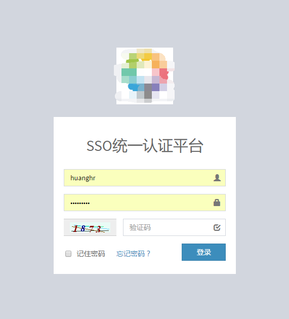

# SSO单点登录系统
运维云平台之单点登录系统，SSO的概念、用途和好处就不在这说明了，总之能接入好接入单点登录的系统就接入，二次开发成本高的系统如果支持LDAP就先接入LDAP，这样运维同学尽可能减>少应用系统账号管理维护工作。<br>

本系统基于Cookie方式，由认证中心统一配置cookie，不支持跨域。这已经基本能满足内部各系统接入需求，对于子系统接入开发成本也是最低。<br>

注：如果要求跨域，只需在本系统中稍加改动就可实现，改成认证中心不配置cookie，在认证中心成功登录后跳转回子系统时把token传递回去，由子系统配置cookie即可。

### 流程图


### 部署运行环境
* Centos6.5 x86_64
* saltstack master
* Python2.7
* Virtualenv
* Django1.9.2

### 安装部署

```
cd salt-deploy
sh update_python2.7.8.sh 
pip install virtualenv
virtualenv ./env
source env/bin/activate
pip install -r pip_requirements.txt
python manage.py makemigrations
python manage.py migrate
python init.py
vim mysite/settings.py #手动修改配置SYS_API和EMAIL等配置
sh service.sh start
```

### 截图


### 技术交流

Email：飞龙 <hhr66@qq.com>
